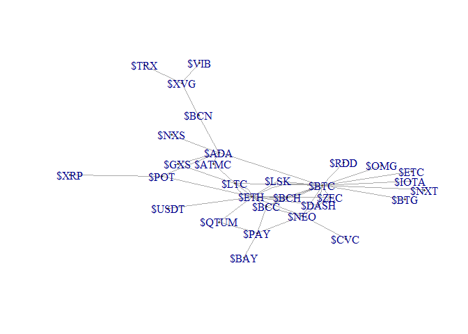
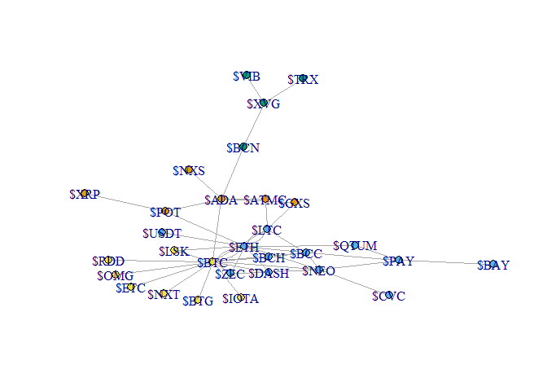
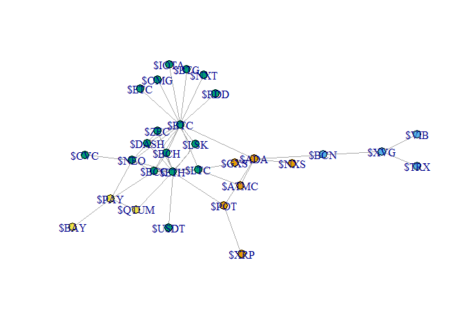

# Q1

load the graph
```{r}
library(igraph)
ga.data <- read.csv('ga_edgelist.csv', header = T)
g <- graph.data.frame(ga.data,directed = F)
```

find the big component
```{r}
comps <- components(g)
maxCompId <- as.numeric(which(max(comps$csize) == comps$csize))
maxCompVertex <- as.numeric(which(comps$membership == maxCompId))
```

create sub-graph from the big component 
```{r}
curG<-delete.vertices(g, -maxCompVertex)
```


## a:
 
```{r}
b <- betweenness(curG, v = V(curG))
b
```

find the Actor with max betweeness
```{r}
which(max(b) == b)
```


```{r}
c <- closeness(curG, vids = V(curG))
c
```

find the Actor with max closeness
```{r}
which(max(c) == c)
```


```{r}
e <- eigen_centrality(curG)
e$vector
```

find the Actor with max eigenvector
```{r}
which(max(e$vector) == e$vector)
```


## b:

* ALGO1: Girvan-Newman community detection

```{r}
gc1 <-  edge.betweenness.community(curG)
gc1
```

  * 1: print community with colors
  
using the membership function that returns community ids for each vertex.
```{r}
 memb1 <- membership(gc1)
```

```{r}
plot(curG, vertex.size=5, vertex.color=memb1, asp=FALSE)
```


  * 2.1: number of communities
```{r}
length(groups(gc1))
```


  * 2.2: size of each community
```{r}
for (value in groups(gc1)) {
    print(length(value))
}
```


  * 3: modularity
  
modularity for each phase 
```{r}
gc1$modularity
```


best modularity score
```{r}
max(gc1$modularity)
```


index (phase, i.e. partitioning) with the best score
```{r}
which.max(gc1$modularity)
```


* ALGO2:walktrap.community

```{r}
gc2 <- walktrap.community(curG)
gc2
```

  * 1: print community with colors
  
using the membership function that returns community ids for each vertex.
```{r}
memb2 <- membership(gc2)
```

```{r}
plot(curG, vertex.size=5, vertex.color=memb2, asp=FALSE)
```


  * 2.1: number of communities
```{r}
length(groups(gc2))
```


  * 2.2: size of each community
```{r}
for (value in groups(gc2)) {
    print(length(value))
}
```


  * 3: modularity
modularity for each phase 
```{r}
gc2$modularity
```


best modularity score
```{r}
max(gc2$modularity)
```


index (phase, i.e. partitioning) with the best score
```{r}
which.max(gc2$modularity)
```


Q2
==
cryptocurrency is domain that we want to invistigate using the skills we learn at this course.
we want to analyze link between coin in the same context. 
our data resource will be twitter, we collect twits that include coin mention from 37 most interesting coins (after little pre-research).
then we build graph using cryptcoins as vertex and relation between two coin as edge.
---

``` r
folder = 'C:/Code/R/Ass3'
setwd(folder)
#Or for all chuncks in this Rmarkdown:
knitr::opts_knit$set(root.dir = folder)
```

``` r
library(igraph)
library(twitteR)
library(tm)
library(httr)
library(igraph)
library(plyr)
source("credentials.R")
```

Read coins list
------------------

``` r
coins <- readLines("coinsList.csv")
coins
```

    ##  [1] "$ETH"   "$LTC"   "$NEO"   "$ETC"   "$XVG"   "$BTG"   "$BCC"  
    ##  [8] "$BTC"   "$QTUM"  "$POT"   "$BCN"   "$NXS"   "$ATMC"  "$GXS"  
    ## [15] "$ADA"   "$PAY"   "$ARDR"  "$DGD"   "$BAY"   "$CVC"   "$KMD"  
    ## [22] "$IOTA"  "$ZEC"   "$XRP"   "$BCH"   "$XLM"   "$DASH"  "$EOS"  
    ## [29] "$NXT"   "$TRX"   "$VIB"   "$LSK"   "$OMG"   "$RDD"   "$FLAP" 
    ## [36] "$USDT"  "$BURST"

Init twitter oauth
------------------
``` r
credentials <- setup_twitter_oauth(consumer_key, consumer_secret, access_token, access_secret)
```

Init 2 vectors for egdes and one for EdgeValue
------------------
``` r
coinFromEdge <- c()
coinToEdge <- c()
```

Itearate over coins list
Search for the currnet coin
Create vertex between current coin to others coins that related in the text on the tweet
------------------
``` r
for (coin in coins) {
  search <- searchTwitter(coin, n=100)
  searchDF <- twListToDF(search) 
  edges <- c()
  for(text in searchDF$text){
    words <- strsplit(text, " ")[[1]]
    words <- unique(words)
    for(word in words) {
      if(word != coin  && word %in% coins) {
        edges <- c(edges, word)
        coinFromEdge<-c(coinFromEdge , coin)
        coinToEdge<-c(coinToEdge , word)
      }
    }
  }
}
```

Now find the mean of Edge occurrence, and filter smallest than 2*mean.
------------------
``` r
res <- data.frame(from = coinFromEdge, to = coinToEdge)
coundEdg <- ddply(res,.(from,to),NROW)
meanEdg <- mean(coundEdg$V1)
coundEdg <- coundEdg[coundEdg$V1 > 2*meanEdg[1],]
```

load the graph
------------------
``` r
library(igraph)
ga.data <- coundEdg[c("from","to")]
g <- graph.data.frame(ga.data,directed = F)
```

``` r
plot(g, vertex.size=1, asp=FALSE)
```


find the big component
------------------
``` r
comps <- components(g)
maxCompId <- as.numeric(which(max(comps$csize) == comps$csize))
maxCompVertex <- as.numeric(which(comps$membership == maxCompId))
```

create sub-graph from the big component
------------------
``` r
curG<-delete.vertices(g, -maxCompVertex)
```

a:
--

``` r
b <- betweenness(curG, v = V(curG))
b
```

    ##     $ADA    $ATMC     $BAY     $BCC     $BCH     $BCN     $BTC     $BTG 
    ## 142.8667   2.0000   0.0000  27.7500   0.0000  78.0000 235.7833   0.0000 
    ##     $CVC    $DASH     $ETC     $ETH     $GXS    $IOTA     $LSK     $LTC 
    ##   0.0000   1.0000   0.0000  98.1000   2.0000   0.0000   0.0000  28.8000 
    ##     $NEO     $NXS     $NXT     $OMG     $PAY     $POT    $QTUM     $RDD 
    ##  47.8000   0.0000   0.0000   0.0000  29.5000  34.0000   3.4000   0.0000 
    ##     $TRX    $USDT     $VIB     $ZEC     $XVG     $XRP 
    ##   0.0000   0.0000   0.0000   0.0000  55.0000   0.0000

find the coin with max betweeness
------------------
``` r
which(max(b) == b)
```

    ## $BTC 
    ##    7

``` r
c <- closeness(curG, vids = V(curG))
c
```

    ##        $ADA       $ATMC        $BAY        $BCC        $BCH        $BCN 
    ## 0.016666667 0.012500000 0.008928571 0.015873016 0.014285714 0.012195122 
    ##        $BTC        $BTG        $CVC       $DASH        $ETC        $ETH 
    ## 0.020000000 0.012820513 0.010752688 0.014705882 0.012820513 0.017241379 
    ##        $GXS       $IOTA        $LSK        $LTC        $NEO        $NXS 
    ## 0.012500000 0.012820513 0.013698630 0.015151515 0.015384615 0.011363636 
    ##        $NXT        $OMG        $PAY        $POT       $QTUM        $RDD 
    ## 0.012820513 0.012820513 0.011904762 0.014285714 0.012195122 0.012820513 
    ##        $TRX       $USDT        $VIB        $ZEC        $XVG        $XRP 
    ## 0.007462687 0.011627907 0.007462687 0.013888889 0.009433962 0.010204082

find the coin with max closeness
------------------
``` r
which(max(c) == c)
```

    ## $BTC 
    ##    7

``` r
e <- eigen_centrality(curG)
e$vector
```

    ##         $ADA        $ATMC         $BAY         $BCC         $BCH 
    ## 0.2394509925 0.1306775838 0.0320562660 0.5801367348 0.4019029813 
    ##         $BCN         $BTC         $BTG         $CVC        $DASH 
    ## 0.0383445969 1.0000000000 0.1560369879 0.0806741734 0.4516374550 
    ##         $ETC         $ETH         $GXS        $IOTA         $LSK 
    ## 0.1560369879 0.9955537253 0.1306775838 0.1560369879 0.3113801926 
    ##         $LTC         $NEO         $NXS         $NXT         $OMG 
    ## 0.5980272590 0.5170195504 0.0373632116 0.1560369879 0.1560369879 
    ##         $PAY         $POT        $QTUM         $RDD         $TRX 
    ## 0.2054401742 0.1975154314 0.1873994706 0.1560369879 0.0009813853 
    ##        $USDT         $VIB         $ZEC         $XVG         $XRP 
    ## 0.1553432046 0.0009813853 0.3818523407 0.0062894402 0.0308197130

find the coin with max eigenvector
------------------
``` r
which(max(e$vector) == e$vector)
```

    ## $BTC 
    ##    7

b:
--

-   ALGO1: Girvan-Newman community detection

``` r
gc1 <-  edge.betweenness.community(curG)
gc1
```

    ## IGRAPH clustering edge betweenness, groups: 4, mod: 0.34
    ## + groups:
    ##   $`1`
    ##   [1] "$ADA"  "$ATMC" "$GXS"  "$NXS"  "$POT"  "$XRP" 
    ##   
    ##   $`2`
    ##    [1] "$BAY"  "$BCC"  "$BCH"  "$CVC"  "$DASH" "$ETH"  "$LTC"  "$NEO" 
    ##    [9] "$PAY"  "$QTUM" "$USDT" "$ZEC" 
    ##   
    ##   $`3`
    ##   [1] "$BCN" "$TRX" "$VIB" "$XVG"
    ##   
    ##   + ... omitted several groups/vertices

-   1: print community with colors

using the membership function that returns community ids for each vertex.

``` r
 memb1 <- membership(gc1)
```

``` r
plot(curG, vertex.size=4, vertex.color=memb1, asp=FALSE)
```



-   2.1: number of communities

``` r
length(groups(gc1))
```

    ## [1] 4

-   2.2: size of each community

``` r
for (value in groups(gc1)) {
    print(length(value))
}
```

    ## [1] 6
    ## [1] 12
    ## [1] 4
    ## [1] 8

-   3: modularity

modularity for each phase

``` r
gc1$modularity
```

    ##  [1] -0.072699653 -0.047960069 -0.029730903 -0.009548611  0.007812500
    ##  [6]  0.027994792  0.047526042  0.064453125  0.073567708  0.093532986
    ## [11]  0.110677083  0.128472222  0.149956597  0.166883681  0.185546875
    ## [16]  0.202473958  0.214626736  0.227213542  0.243489583  0.248263889
    ## [21]  0.264322917  0.286458333  0.302300347  0.313585069  0.324218750
    ## [26]  0.334635417  0.344835069  0.271918403  0.114366319  0.000000000

best modularity score

``` r
max(gc1$modularity)
```

    ## [1] 0.3448351

index (phase, i.e. partitioning) with the best score

``` r
which.max(gc1$modularity)
```

    ## [1] 27

-   ALGO2:walktrap.community

``` r
gc2 <- walktrap.community(curG)
gc2
```

    ## IGRAPH clustering walktrap, groups: 4, mod: 0.31
    ## + groups:
    ##   $`1`
    ##   [1] "$ADA"  "$ATMC" "$GXS"  "$NXS"  "$POT"  "$XRP" 
    ##   
    ##   $`2`
    ##   [1] "$BCN" "$TRX" "$VIB" "$XVG"
    ##   
    ##   $`3`
    ##    [1] "$BCC"  "$BCH"  "$BTC"  "$BTG"  "$CVC"  "$DASH" "$ETC"  "$ETH" 
    ##    [9] "$IOTA" "$LSK"  "$LTC"  "$NEO"  "$NXT"  "$OMG"  "$RDD"  "$USDT"
    ##   [17] "$ZEC" 
    ##   + ... omitted several groups/vertices

-   1: print community with colors

using the membership function that returns community ids for each vertex.

``` r
memb2 <- membership(gc2)
```

``` r
plot(curG, vertex.size=5, vertex.color=memb2, asp=FALSE)
```



-   2.1: number of communities

``` r
length(groups(gc2))
```

    ## [1] 4

-   2.2: size of each community

``` r
for (value in groups(gc2)) {
    print(length(value))
}
```

    ## [1] 6
    ## [1] 4
    ## [1] 17
    ## [1] 3

-   3: modularity modularity for each phase

``` r
gc2$modularity
```

    ##  [1]  0.000000000 -0.054470498 -0.042100683 -0.028211802 -0.007378469
    ##  [6]  0.011718755  0.026041673  0.044270840  0.061631955  0.088107653
    ## [11]  0.108289942  0.130425364  0.150390625  0.164713532  0.184895828
    ## [16]  0.192925349  0.211588547  0.219401032  0.226996511  0.234375000
    ## [21]  0.241536453  0.248480886  0.255208343  0.274739593  0.281250000
    ## [26]  0.299913168  0.311197907  0.271918416  0.114366353  0.000000000

best modularity score

``` r
max(gc2$modularity)
```

    ## [1] 0.3111979

index (phase, i.e. partitioning) with the best score

``` r
which.max(gc2$modularity)
```

    ## [1] 27


