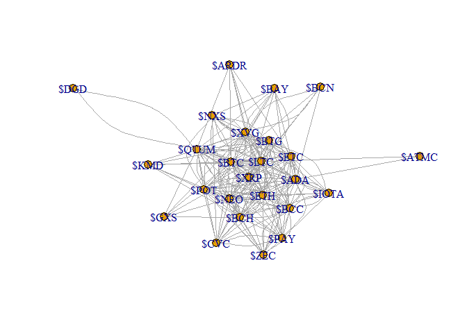
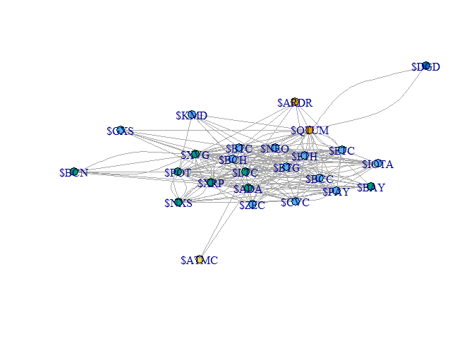

# Q1

load the graph
```{r}
library(igraph)
ga.data <- read.csv('ga_edgelist.csv', header = T)
g <- graph.data.frame(ga.data,directed = F)
```

find the big component
```{r}
comps <- components(g)
maxCompId <- as.numeric(which(max(comps$csize) == comps$csize))
maxCompVertex <- as.numeric(which(comps$membership == maxCompId))
```

create sub-graph from the big component 
```{r}
curG<-delete.vertices(g, -maxCompVertex)
```


## a:
 
```{r}
b <- betweenness(curG, v = V(curG))
b
```

find the Actor with max betweeness
```{r}
which(max(b) == b)
```


```{r}
c <- closeness(curG, vids = V(curG))
c
```

find the Actor with max closeness
```{r}
which(max(c) == c)
```


```{r}
e <- eigen_centrality(curG)
e$vector
```

find the Actor with max eigenvector
```{r}
which(max(e$vector) == e$vector)
```


## b:

* ALGO1: Girvan-Newman community detection

```{r}
gc1 <-  edge.betweenness.community(curG)
gc1
```

  * 1: print community with colors
  
using the membership function that returns community ids for each vertex.
```{r}
 memb1 <- membership(gc1)
```

```{r}
plot(curG, vertex.size=5, vertex.color=memb1, asp=FALSE)
```


  * 2.1: number of communities
```{r}
length(groups(gc1))
```


  * 2.2: size of each community
```{r}
for (value in groups(gc1)) {
    print(length(value))
}
```


  * 3: modularity
  
modularity for each phase 
```{r}
gc1$modularity
```


best modularity score
```{r}
max(gc1$modularity)
```


index (phase, i.e. partitioning) with the best score
```{r}
which.max(gc1$modularity)
```


* ALGO2:walktrap.community

```{r}
gc2 <- walktrap.community(curG)
gc2
```

  * 1: print community with colors
  
using the membership function that returns community ids for each vertex.
```{r}
memb2 <- membership(gc2)
```

```{r}
plot(curG, vertex.size=5, vertex.color=memb2, asp=FALSE)
```


  * 2.1: number of communities
```{r}
length(groups(gc2))
```


  * 2.2: size of each community
```{r}
for (value in groups(gc2)) {
    print(length(value))
}
```


  * 3: modularity
modularity for each phase 
```{r}
gc2$modularity
```


best modularity score
```{r}
max(gc2$modularity)
```


index (phase, i.e. partitioning) with the best score
```{r}
which.max(gc2$modularity)
```


Q2
==

``` r
folder = 'C:/Code/R/Ass3'
setwd(folder)

#Or for all chuncks in this Rmarkdown:
knitr::opts_knit$set(root.dir = folder)
```

``` r
#install.packages("twitteR")
#install.packages("tm")
#install.packages("httr")
#install.packages("igraph")
library(igraph)
```
``` r
library(twitteR)
```

``` r
library(tm)
```


``` r
library(httr)
```

``` r
source("credentials.R")
```

Read coins list
===============

``` r
library(igraph)
coins <- readLines("coinsList.csv")
```

Init twitter oauth
------------------

``` r
credentials <- setup_twitter_oauth(consumer_key, consumer_secret, access_token, access_secret)
```

    ## [1] "Using direct authentication"

Init 2 vectors for egdes
========================

``` r
coinFromEdge <- c()
coinToEdge <- c()
```

Itearate over coins list
========================

Search for the currnet coin
===========================

Create vertex between current coin to others coins that related in the text on the tweet
========================================================================================

``` r
for (coin in coins) {
  search <- searchTwitter(coin, n=100)
  searchDF <- twListToDF(search) 
  edges <- c()
  for(text in searchDF$text){
    words <- strsplit(text, " ")[[1]]
    words <- unique(words)
    for(word in words) {
      if(word != coin && !(word %in% edges) && word %in% coins) {
        edges <- c(edges, word)
        coinFromEdge<-c(coinFromEdge , coin)
        coinToEdge<-c(coinToEdge , word)
      }
    }
  }
}
```

Now save the data to csv file
=============================

``` r
res <- cbind(from = coinFromEdge, to = coinToEdge)
write.csv(res,file="twits_edgelist.csv",row.names = F)
```

load the graph
==============

``` r
library(igraph)
ga.data <- read.csv('twits_edgelist.csv', header = T)
g <- graph.data.frame(ga.data,directed = F)
```

find the big component
======================

``` r
comps <- components(g)
maxCompId <- as.numeric(which(max(comps$csize) == comps$csize))
maxCompVertex <- as.numeric(which(comps$membership == maxCompId))
```

create sub-graph from the big component
=======================================

``` r
curG<-delete.vertices(g, -maxCompVertex)
```

a:
--

``` r
b <- betweenness(curG, v = V(curG))
b
```

    ##       $ETH       $LTC       $NEO       $ETC       $XVG       $BTG 
    ##  4.0926501 36.4097649  3.6645476  2.9068305 12.0821877  5.2947886 
    ##       $BCC       $BTC      $QTUM       $POT       $BCN       $NXS 
    ##  3.7116006 13.6295040 29.5774955  3.7013043  0.0000000  0.6446135 
    ##      $ATMC       $GXS       $ADA       $PAY      $ARDR       $DGD 
    ##  0.0000000  0.0800000 17.1304711  1.1873617  0.0000000  0.0000000 
    ##       $BAY       $CVC       $KMD      $IOTA       $ZEC       $XRP 
    ##  0.4379887  0.8622311  0.0000000  0.1166667  0.1343874  5.9055963 
    ##       $BCH 
    ##  5.4300098

find the Actor with max betweeness
==================================

``` r
which(max(b) == b)
```

    ## $LTC 
    ##    2

``` r
c <- closeness(curG, vids = V(curG))
c
```

    ##       $ETH       $LTC       $NEO       $ETC       $XVG       $BTG 
    ## 0.03225806 0.04000000 0.03225806 0.03030303 0.03225806 0.03125000 
    ##       $BCC       $BTC      $QTUM       $POT       $BCN       $NXS 
    ## 0.03125000 0.03703704 0.03225806 0.03125000 0.02272727 0.02439024 
    ##      $ATMC       $GXS       $ADA       $PAY      $ARDR       $DGD 
    ## 0.02127660 0.02380952 0.03448276 0.02941176 0.02380952 0.01851852 
    ##       $BAY       $CVC       $KMD      $IOTA       $ZEC       $XRP 
    ## 0.02500000 0.02777778 0.02439024 0.02631579 0.02631579 0.03030303 
    ##       $BCH 
    ## 0.03333333

find the Actor with max closeness
=================================

``` r
which(max(c) == c)
```

    ## $LTC 
    ##    2

``` r
e <- eigen_centrality(curG)
e$vector
```

    ##       $ETH       $LTC       $NEO       $ETC       $XVG       $BTG 
    ## 0.85005003 1.00000000 0.85130824 0.72095482 0.83548814 0.70304506 
    ##       $BCC       $BTC      $QTUM       $POT       $BCN       $NXS 
    ## 0.73716838 0.86431971 0.70379743 0.66076444 0.23643854 0.44432374 
    ##      $ATMC       $GXS       $ADA       $PAY      $ARDR       $DGD 
    ## 0.07961321 0.22951140 0.71841851 0.52186058 0.23047045 0.06521295 
    ##       $BAY       $CVC       $KMD      $IOTA       $ZEC       $XRP 
    ## 0.33140450 0.44269878 0.26014488 0.50003874 0.51857958 0.84971437 
    ##       $BCH 
    ## 0.83188571

find the Actor with max eigenvector
===================================

``` r
which(max(e$vector) == e$vector)
```

    ## $LTC 
    ##    2

b:
--

-   ALGO1: Girvan-Newman community detection

``` r
gc1 <-  edge.betweenness.community(curG)
gc1
```

    ## IGRAPH clustering edge betweenness, groups: 1, mod: 0
    ## + groups:
    ##   $`1`
    ##    [1] "$ETH"  "$LTC"  "$NEO"  "$ETC"  "$XVG"  "$BTG"  "$BCC"  "$BTC" 
    ##    [9] "$QTUM" "$POT"  "$BCN"  "$NXS"  "$ATMC" "$GXS"  "$ADA"  "$PAY" 
    ##   [17] "$ARDR" "$DGD"  "$BAY"  "$CVC"  "$KMD"  "$IOTA" "$ZEC"  "$XRP" 
    ##   [25] "$BCH" 
    ## 

-   1: print community with colors

using the membership function that returns community ids for each vertex.

``` r
 memb1 <- membership(gc1)
```

``` r
plot(curG, vertex.size=5, vertex.color=memb1, asp=FALSE)
```



-   2.1: number of communities

``` r
length(groups(gc1))
```

    ## [1] 1

-   2.2: size of each community

``` r
for (value in groups(gc1)) {
    print(length(value))
}
```

    ## [1] 25

-   3: modularity

modularity for each phase

``` r
gc1$modularity
```

    ##  [1] -5.083990e-02 -4.852513e-02 -4.525473e-02 -4.025356e-02 -3.152541e-02
    ##  [6] -3.412687e-02 -2.289282e-02 -2.548366e-02 -1.812525e-02 -2.506955e-02
    ## [11] -2.477224e-02 -4.353458e-02 -4.081633e-02 -4.090127e-02 -2.722504e-02
    ## [16] -1.562998e-02 -1.140394e-02 -8.972371e-03 -5.340950e-03 -3.185457e-03
    ## [21] -1.783856e-03 -7.645098e-04 -1.274183e-04 -4.247276e-05  0.000000e+00

best modularity score

``` r
max(gc1$modularity)
```

    ## [1] 0

index (phase, i.e. partitioning) with the best score

``` r
which.max(gc1$modularity)
```

    ## [1] 25

-   ALGO2:walktrap.community

``` r
gc2 <- walktrap.community(curG)
gc2
```

    ## IGRAPH clustering walktrap, groups: 5, mod: 0.057
    ## + groups:
    ##   $`1`
    ##   [1] "$QTUM" "$ARDR"
    ##   
    ##   $`2`
    ##    [1] "$ETH"  "$NEO"  "$ETC"  "$BTG"  "$BCC"  "$BTC"  "$GXS"  "$PAY" 
    ##    [9] "$CVC"  "$KMD"  "$IOTA" "$ZEC"  "$BCH" 
    ##   
    ##   $`3`
    ##   [1] "$LTC" "$XVG" "$POT" "$BCN" "$NXS" "$ADA" "$BAY" "$XRP"
    ##   
    ##   + ... omitted several groups/vertices

-   1: print community with colors

using the membership function that returns community ids for each vertex.

``` r
memb2 <- membership(gc2)
```

``` r
plot(curG, vertex.size=5, vertex.color=memb2, asp=FALSE)
```



-   2.1: number of communities

``` r
length(groups(gc2))
```

    ## [1] 5

-   2.2: size of each community

``` r
for (value in groups(gc2)) {
    print(length(value))
}
```

    ## [1] 2
    ## [1] 13
    ## [1] 8
    ## [1] 1
    ## [1] 1

-   3: modularity modularity for each phase

``` r
gc2$modularity
```

    ##  [1]  0.000000e+00 -4.825967e-02 -4.755888e-02 -4.879060e-02 -4.150651e-02
    ##  [6] -4.338593e-02 -3.535858e-02 -3.166345e-02 -2.973093e-02 -2.378475e-02
    ## [11] -2.460235e-02 -1.854998e-02 -1.065005e-02  1.433454e-03  2.146998e-02
    ## [16]  1.921893e-02  2.583406e-02  2.447492e-02  3.764148e-02  5.352631e-02
    ## [21]  5.660558e-02  7.475183e-03 -1.274157e-04 -4.247211e-05  0.000000e+00

best modularity score

``` r
max(gc2$modularity)
```

    ## [1] 0.05660558

index (phase, i.e. partitioning) with the best score

``` r
which.max(gc2$modularity)
```

    ## [1] 21


